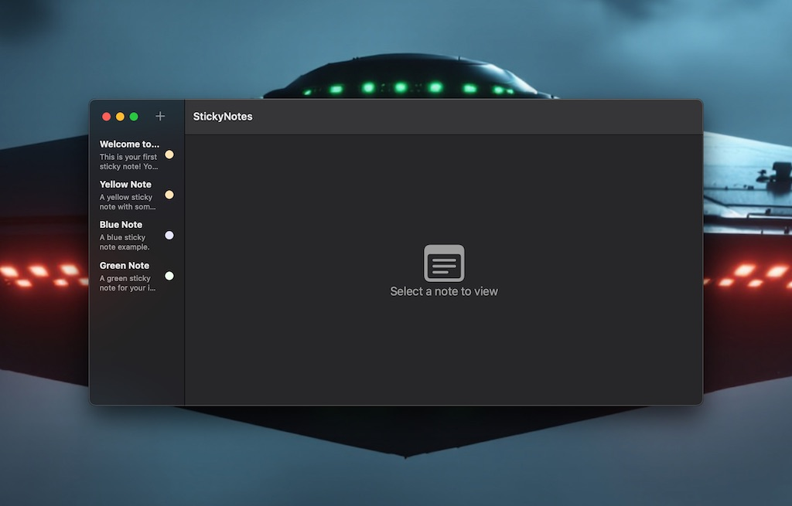

# StickyNotes Desktop

A macOS sticky notes app built with SwiftUI and Core Data. Notes open as floating windows that sit above other applications. Notes auto-save as you type, persist across restarts, and sync across devices via iCloud.

[](LICENSE)
[](https://swift.org/)
[](https://www.apple.com/macos/)
[](https://developer.apple.com/xcode/)

<p align="center">
  
</p>

**Author:** Jason Paul Michaels
**GitHub:** https://github.com/sanchez314c/desktop-stickies

---

## Features

- Floating borderless windows that stay above other apps
- Rich text editor (bold, italic, underline, alignment, bullet/numbered lists, font size)
- Markdown mode toggle per note
- Six note colors: yellow, blue, green, pink, purple, orange
- Search across all notes with debounced filtering
- Color filter in the main window
- Per-note tags
- Lock notes against accidental edits
- Auto-save (500ms debounce)
- Core Data persistence with CloudKit iCloud sync
- Batch import/export to JSON
- Export individual notes as text, markdown, JSON, or PDF
- In-memory note cache (LRU) for fast preview rendering
- Universal binary: Intel and Apple Silicon

## Requirements

- macOS 13.0 (Ventura) or later
- Xcode 15.0 or later
- Swift 5.10 or later

## Quick Start

```bash
git clone https://github.com/sanchez314c/desktop-stickies.git
cd desktop-stickies

# Open in Xcode
open StickyNotes/StickyNotes.xcodeproj
# Press Cmd+R to build and run

# Or build from command line
xcodebuild -scheme StickyNotes \
  -project StickyNotes/StickyNotes.xcodeproj \
  -configuration Debug build
```

No package dependencies to resolve — the project uses zero third-party Swift packages.

## Building

```bash
# Debug
xcodebuild -scheme StickyNotes -project StickyNotes/StickyNotes.xcodeproj -configuration Debug build

# Release
xcodebuild -scheme StickyNotes -project StickyNotes/StickyNotes.xcodeproj -configuration Release build

# Universal binary
xcodebuild -scheme StickyNotes -project StickyNotes/StickyNotes.xcodeproj \
  -configuration Release build ARCHS="arm64 x86_64" ONLY_ACTIVE_ARCH=NO
```

SPM (library development):
```bash
swift build
swift test
```

See [docs/BUILD_COMPILE.md](docs/BUILD_COMPILE.md) for the full build guide including Fastlane distribution.

## Usage

**Create a note:**
- Menu bar: `File > New Note` or `Cmd+N`
- Click the `+` button in the main window toolbar
- New notes open as floating windows immediately

**Edit a note:**
- Click anywhere in the note window to edit
- Hover over the note to reveal the formatting toolbar
- Drag the title bar to reposition the window
- Drag the window edges to resize

**Note colors:** Click the palette icon in the note title bar to change color.

**Markdown mode:** Click the text badge icon in the note title bar to toggle markdown editing.

**Search:** Type in the search bar in the main window. Results filter as you type (300ms debounce).

**Color filter:** Use the color dropdown in the main window toolbar to show only notes of a specific color.

## Keyboard Shortcuts

| Action | Shortcut |
|--------|---------|
| New note | Cmd+N |
| Cancel / close sheet | Esc |
| Create (in new note sheet) | Return |
| Change color to yellow | (in color picker: 1) |
| Change color to blue | (in color picker: 2) |
| Change color to green | (in color picker: 3) |
| Change color to pink | (in color picker: 4) |
| Change color to purple | (in color picker: 5) |
| Change color to orange | (in color picker: 6) |

## Project Structure

```
mac-stickies/
├── Package.swift               # SPM manifest: StickyNotes + StickyNotesCore
├── Sources/                    # StickyNotesCore library
│   ├── Models/                 # Note struct, NoteEntity, Extensions
│   ├── Persistence/            # PersistenceController, DataModel, MigrationManager
│   └── Services/               # NoteService, NoteRepository, BackgroundOperationManager
├── StickyNotes/                # macOS app target
│   ├── StickyNotes.xcodeproj
│   ├── Models/                 # App-layer Note (NSAttributedString content), NoteColor
│   ├── Views/                  # ContentView, NoteWindowView, RichTextEditor
│   ├── ViewModels/             # NotesViewModel, NoteViewModel
│   ├── Services/               # WindowManager, PersistenceService, CacheService, etc.
│   └── Resources/              # Assets, entitlements, Core Data model
├── Tests/                      # XCTest suites
├── fastlane/                   # Distribution automation
├── scripts/                    # Build and utility scripts
├── config/                     # Build config, xcconfig files
├── monitoring/                 # Production monitoring scripts
├── docs/                       # Full documentation
└── .github/workflows/          # CI/CD pipelines
```

## Data Storage

Notes are stored in Core Data (SQLite) at:
`~/Library/Containers/com.superclaude.stickynotes/Data/Library/Application Support/`

When iCloud is available and the CloudKit container `iCloud.com.stickynotes.app` is configured, notes sync automatically across devices.

Legacy file-based storage (one JSON file per note) at `~/Library/Application Support/StickyNotes/` is supported as a fallback and can be migrated via `CoreDataPersistenceService.migrateFromJSON()`.

## Testing

```bash
# SPM unit tests
swift test

# Xcode tests
xcodebuild test \
  -scheme StickyNotes \
  -project StickyNotes/StickyNotes.xcodeproj \
  -destination 'platform=macOS'

# With coverage
swift test --enable-code-coverage
```

Tests use in-memory Core Data (`PersistenceController(inMemory: true)`). The test suite covers repository CRUD, service layer operations, note model validation, and background import/export.

## Distribution

Distribution uses Fastlane. See [docs/DEPLOYMENT.md](docs/DEPLOYMENT.md) for the full guide.

```bash
fastlane test             # Run tests
fastlane build_direct     # Direct distribution + notarize + DMG
fastlane build_app_store  # Mac App Store build
fastlane beta             # TestFlight
fastlane release          # App Store submit
```

## Documentation

Full documentation is in [docs/](docs/). Key references:

- [Architecture](docs/ARCHITECTURE.md) — system design and data flow
- [API Reference](docs/API.md) — StickyNotesCore public API
- [Build Guide](docs/BUILD_COMPILE.md) — all build options
- [Deployment](docs/DEPLOYMENT.md) — distribution and release
- [Development](docs/DEVELOPMENT.md) — setup and contribution guide
- [AI Guide](AGENTS.md) — guide for AI assistants working on this codebase

## Contributing

See [CONTRIBUTING.md](CONTRIBUTING.md) for contribution guidelines and [CODE_OF_CONDUCT.md](CODE_OF_CONDUCT.md) for community standards.

## License

MIT License — Copyright (c) 2026 Jason Paul Michaels. See [LICENSE](LICENSE).
